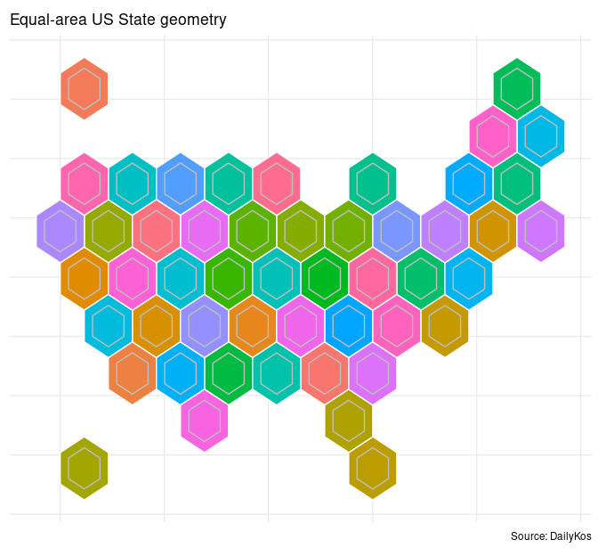

uspols
======

A collection of US political data, including (1) federal election
returns, (2) Twitter details for US lawmakers, and (3) some relevant
political boundary files as simple feature geometries. Aggregated from
existing resources as an **R data package**.

Additionally included: an R function for scraping time-line details for
the Trump presidency from Wikipedia.

Election returns included in package:

> -   House and Senate returns by congressional district and state,
>     respectively, (from 1976 onward) made available via
>     [MEDSL](https://github.com/MEDSL).  
> -   Presidential returns by congressional district for 2008, 2012, and
>     2016 elections via [The
>     DailyKos](https://www.dailykos.com/stories/2018/2/21/1742660/-The-ultimate-Daily-Kos-Elections-guide-to-all-of-our-data-sets#1).
> -   Presidential returns by state for elections since 1864, scraped
>     from Wikipedia.

Formats have been tweaked for uniform output across data sets. Links to
R code demonstrate all details of work-flow from raw data to package
table.

Installation
------------

``` r
library(tidyverse)
```

``` r
library(devtools)
devtools::install_github("jaytimm/uspols")
library(uspols) 
```

Details
-------

### §1 MEDSL: House returns by congressional district (1976-)

[Code](https://github.com/jaytimm/uspols/blob/master/mds/medsl.md)

``` r
uspols::uspols_medsl_house %>%
  head() %>% knitr::kable()
```

<table>
<colgroup>
<col style="width: 4%" />
<col style="width: 8%" />
<col style="width: 11%" />
<col style="width: 12%" />
<col style="width: 25%" />
<col style="width: 5%" />
<col style="width: 9%" />
<col style="width: 8%" />
<col style="width: 9%" />
<col style="width: 5%" />
</colgroup>
<thead>
<tr class="header">
<th style="text-align: right;">year</th>
<th style="text-align: right;">congress</th>
<th style="text-align: left;">state_abbrev</th>
<th style="text-align: left;">district_code</th>
<th style="text-align: left;">winner</th>
<th style="text-align: left;">icpsr</th>
<th style="text-align: left;">party_win</th>
<th style="text-align: right;">democrat</th>
<th style="text-align: right;">republican</th>
<th style="text-align: right;">other</th>
</tr>
</thead>
<tbody>
<tr class="odd">
<td style="text-align: right;">1976</td>
<td style="text-align: right;">95</td>
<td style="text-align: left;">AL</td>
<td style="text-align: left;">01</td>
<td style="text-align: left;">Jack Edwards</td>
<td style="text-align: left;">10721</td>
<td style="text-align: left;">republican</td>
<td style="text-align: right;">37.48</td>
<td style="text-align: right;">62.52</td>
<td style="text-align: right;">0.00</td>
</tr>
<tr class="even">
<td style="text-align: right;">1976</td>
<td style="text-align: right;">95</td>
<td style="text-align: left;">AL</td>
<td style="text-align: left;">02</td>
<td style="text-align: left;">William L. “Bill” Dickinson</td>
<td style="text-align: left;">10717</td>
<td style="text-align: left;">republican</td>
<td style="text-align: right;">42.39</td>
<td style="text-align: right;">57.60</td>
<td style="text-align: right;">0.00</td>
</tr>
<tr class="odd">
<td style="text-align: right;">1976</td>
<td style="text-align: right;">95</td>
<td style="text-align: left;">AL</td>
<td style="text-align: left;">03</td>
<td style="text-align: left;">Bill Nichols</td>
<td style="text-align: left;">11037</td>
<td style="text-align: left;">democrat</td>
<td style="text-align: right;">98.97</td>
<td style="text-align: right;">0.00</td>
<td style="text-align: right;">1.03</td>
</tr>
<tr class="even">
<td style="text-align: right;">1976</td>
<td style="text-align: right;">95</td>
<td style="text-align: left;">AL</td>
<td style="text-align: left;">04</td>
<td style="text-align: left;">Tom Bevill</td>
<td style="text-align: left;">11000</td>
<td style="text-align: left;">democrat</td>
<td style="text-align: right;">80.38</td>
<td style="text-align: right;">19.62</td>
<td style="text-align: right;">0.00</td>
</tr>
<tr class="odd">
<td style="text-align: right;">1976</td>
<td style="text-align: right;">95</td>
<td style="text-align: left;">AL</td>
<td style="text-align: left;">05</td>
<td style="text-align: left;">Ronnie G. Flippo</td>
<td style="text-align: left;">14419</td>
<td style="text-align: left;">democrat</td>
<td style="text-align: right;">99.99</td>
<td style="text-align: right;">0.00</td>
<td style="text-align: right;">0.00</td>
</tr>
<tr class="even">
<td style="text-align: right;">1976</td>
<td style="text-align: right;">95</td>
<td style="text-align: left;">AL</td>
<td style="text-align: left;">06</td>
<td style="text-align: left;">John H. Buchanan, Jr.</td>
<td style="text-align: left;">10706</td>
<td style="text-align: left;">republican</td>
<td style="text-align: right;">42.69</td>
<td style="text-align: right;">56.68</td>
<td style="text-align: right;">0.63</td>
</tr>
</tbody>
</table>

### §2 MEDSL: Senate returns by states (1976-)

``` r
uspols::uspols_medsl_senate
```

------------------------------------------------------------------------

### §3 DailyKos: Presidential returns by congressional district (2008-)

[Code](https://github.com/jaytimm/uspols/blob/master/mds/daily-kos.md)
\| [DailyKos
dataset](https://docs.google.com/spreadsheets/d/1zLNAuRqPauss00HDz4XbTH2HqsCzMe0pR8QmD1K8jk8/edit#gid=0)

``` r
uspols::uspols_dk_pres %>%
  head() %>% knitr::kable() 
```

|  year| state\_abbrev | district\_code | winner       | party\_win |  democrat|  republican|
|-----:|:--------------|:---------------|:-------------|:-----------|---------:|-----------:|
|  2008| AL            | 01             | John McCain  | republican |      38.5|        60.9|
|  2012| AL            | 01             | Mitt Romney  | republican |      37.4|        61.8|
|  2016| AL            | 01             | Donald Trump | republican |      34.1|        63.5|
|  2008| AL            | 02             | John McCain  | republican |      35.0|        64.5|
|  2012| AL            | 02             | Mitt Romney  | republican |      36.4|        62.9|
|  2016| AL            | 02             | Donald Trump | republican |      33.0|        64.9|

------------------------------------------------------------------------

### §4 Wikipedia: Presidential returns by state (1864-)

[Code](https://github.com/jaytimm/uspols/blob/master/mds/wikipedia.md)

``` r
uspols::uspols_wiki_pres %>%
  head() %>% knitr::kable()
```

|  year| state\_abbrev | district\_code | winner              | party\_win |  democrat|  republican|
|-----:|:--------------|:---------------|:--------------------|:-----------|---------:|-----------:|
|  1864| CA            | statewide      | Abraham Lincoln     | republican |     41.40|       58.60|
|  1864| CT            | statewide      | Abraham Lincoln     | republican |     48.60|       51.40|
|  1864| DE            | statewide      | George B. McClellan | democrat   |     51.80|       48.20|
|  1864| IA            | statewide      | Abraham Lincoln     | republican |     36.92|       63.08|
|  1864| IL            | statewide      | Abraham Lincoln     | republican |     45.60|       54.40|
|  1864| IN            | statewide      | Abraham Lincoln     | republican |     46.50|       53.50|

------------------------------------------------------------------------

### §5 Lawmaker Twitter handles: Congresses 115 & 116

[Code](https://github.com/jaytimm/twitter-and-us-lawmakers/blob/master/twitter-handles.md)

``` r
uspols::uspols_twitter_handles %>% head() %>% knitr::kable()
```

<table>
<colgroup>
<col style="width: 6%" />
<col style="width: 6%" />
<col style="width: 4%" />
<col style="width: 9%" />
<col style="width: 14%" />
<col style="width: 8%" />
<col style="width: 12%" />
<col style="width: 9%" />
<col style="width: 9%" />
<col style="width: 9%" />
<col style="width: 10%" />
</colgroup>
<thead>
<tr class="header">
<th style="text-align: right;">congress</th>
<th style="text-align: left;">chamber</th>
<th style="text-align: right;">icpsr</th>
<th style="text-align: left;">bioguide_id</th>
<th style="text-align: left;">member</th>
<th style="text-align: left;">party_name</th>
<th style="text-align: left;">screen_name</th>
<th style="text-align: left;">account_type</th>
<th style="text-align: left;">handle_type</th>
<th style="text-align: left;">state_abbrev</th>
<th style="text-align: left;">district_code</th>
</tr>
</thead>
<tbody>
<tr class="odd">
<td style="text-align: right;">115</td>
<td style="text-align: left;">House</td>
<td style="text-align: right;">21565</td>
<td style="text-align: left;">C001108</td>
<td style="text-align: left;">James Comer</td>
<td style="text-align: left;">republican</td>
<td style="text-align: left;">KYCOMER</td>
<td style="text-align: left;">campaign</td>
<td style="text-align: left;">prev_names</td>
<td style="text-align: left;">KY</td>
<td style="text-align: left;">01</td>
</tr>
<tr class="even">
<td style="text-align: right;">115</td>
<td style="text-align: left;">House</td>
<td style="text-align: right;">21743</td>
<td style="text-align: left;">R000608</td>
<td style="text-align: left;">Jacky Rosen</td>
<td style="text-align: left;">democratic</td>
<td style="text-align: left;">REPJACKYROSEN</td>
<td style="text-align: left;">office</td>
<td style="text-align: left;">prev_names</td>
<td style="text-align: left;">NV</td>
<td style="text-align: left;">03</td>
</tr>
<tr class="odd">
<td style="text-align: right;">115</td>
<td style="text-align: left;">House</td>
<td style="text-align: right;">21715</td>
<td style="text-align: left;">E000297</td>
<td style="text-align: left;">Adriano Espaillat</td>
<td style="text-align: left;">democratic</td>
<td style="text-align: left;">REPESPAILLAT</td>
<td style="text-align: left;">office</td>
<td style="text-align: left;">screen_name</td>
<td style="text-align: left;">NY</td>
<td style="text-align: left;">13</td>
</tr>
<tr class="even">
<td style="text-align: right;">115</td>
<td style="text-align: left;">House</td>
<td style="text-align: right;">21725</td>
<td style="text-align: left;">H001074</td>
<td style="text-align: left;">Trey Hollingsworth</td>
<td style="text-align: left;">republican</td>
<td style="text-align: left;">REPTREY</td>
<td style="text-align: left;">office</td>
<td style="text-align: left;">screen_name</td>
<td style="text-align: left;">IN</td>
<td style="text-align: left;">09</td>
</tr>
<tr class="odd">
<td style="text-align: right;">115</td>
<td style="text-align: left;">House</td>
<td style="text-align: right;">21566</td>
<td style="text-align: left;">E000296</td>
<td style="text-align: left;">Dwight Evans</td>
<td style="text-align: left;">democratic</td>
<td style="text-align: left;">REPDWIGHTEVANS</td>
<td style="text-align: left;">office</td>
<td style="text-align: left;">screen_name</td>
<td style="text-align: left;">PA</td>
<td style="text-align: left;">02</td>
</tr>
<tr class="even">
<td style="text-align: right;">115</td>
<td style="text-align: left;">House</td>
<td style="text-align: right;">21734</td>
<td style="text-align: left;">M001198</td>
<td style="text-align: left;">Roger Marshall</td>
<td style="text-align: left;">republican</td>
<td style="text-align: left;">ROGERMARSHALLMD</td>
<td style="text-align: left;">campaign</td>
<td style="text-align: left;">screen_name</td>
<td style="text-align: left;">KS</td>
<td style="text-align: left;">01</td>
</tr>
</tbody>
</table>

------------------------------------------------------------------------

### §6 DailyKos: Simple feature geometries

[States
shapefile](https://docs.google.com/spreadsheets/d/1LrBXlqrtSZwyYOkpEEXFwQggvtR0bHHTxs9kq4kjOjw/edit#gid=1278876419)

``` r
library(sf)
uspols::xsf_TileOutv10 %>% 
  ggplot() + 
  geom_sf(aes(fill = state),
           color = 'white') +
  geom_sf(data = uspols::xsf_TileInv10, 
          fill = NA, 
          show.legend = F, 
          color="gray", 
          lwd=.5) +
  ggsflabel::geom_sf_text(data = uspols::xsf_TileInv10,
                          aes(label = state_abbrev), 
                          size = 3,
                          color='black') +
  # scale_fill_distiller(palette = "RdBu", direction=-1) +
  theme_minimal()+
  theme(axis.text.x=element_blank(),
        axis.text.y=element_blank(),
        axis.title.x=element_blank(),
        axis.title.y=element_blank(),
        legend.position = 'none') +
labs(title = "Equal-area US State geometry",
     caption = "Source: DailyKos")
```



------------------------------------------------------------------------

### §7 Wikipedia: Trump timeline

`uspols_wiki_timeline()`: Certainly not gospel, but enough information
to get your bearings. Events for a given day have been separated into
distinct rows per Wikipedia bullet points, and utilized here just to
break the text up some. Function call scrapes event data summarized in
[this cache of Wikipedia
pages](https://en.wikipedia.org/wiki/Timeline_of_the_Donald_Trump_presidency).

``` r
timeline <- uspols::uspols_wiki_timeline() 

timeline %>%
  select(-weekof, -daypres, -dow) %>%
  filter(date == '2017-01-20') %>%
  knitr::kable() ## Day 1 -- 20 Jan 2017 --
```

<table>
<colgroup>
<col style="width: 1%" />
<col style="width: 2%" />
<col style="width: 1%" />
<col style="width: 94%" />
</colgroup>
<thead>
<tr class="header">
<th style="text-align: left;">quarter</th>
<th style="text-align: left;">date</th>
<th style="text-align: right;">bullet</th>
<th style="text-align: left;">Events</th>
</tr>
</thead>
<tbody>
<tr class="odd">
<td style="text-align: left;">2017_Q1</td>
<td style="text-align: left;">2017-01-20</td>
<td style="text-align: right;">1</td>
<td style="text-align: left;">45th President Donald Trump and 48th Vice President Mike Pence take the Oath of Office.</td>
</tr>
<tr class="even">
<td style="text-align: left;">2017_Q1</td>
<td style="text-align: left;">2017-01-20</td>
<td style="text-align: right;">2</td>
<td style="text-align: left;">President Trump proclaims a National Day of Patriotic Devotion.</td>
</tr>
<tr class="odd">
<td style="text-align: left;">2017_Q1</td>
<td style="text-align: left;">2017-01-20</td>
<td style="text-align: right;">3</td>
<td style="text-align: left;">According to contested reports in December 2017, while seated at Trump’s inauguration speech, forthcoming National Security Advisor Michael Flynn texts a former business partner that Russian sanctions blocking a private Russian-backed plan to build nuclear plants in the Middle East will now be ‘ripped up’.</td>
</tr>
<tr class="even">
<td style="text-align: left;">2017_Q1</td>
<td style="text-align: left;">2017-01-20</td>
<td style="text-align: right;">4</td>
<td style="text-align: left;">State officials in Florida, Delaware and New York confirm that they have not received paperwork that the President has relinquished control over his companies despite earlier promises to do so.</td>
</tr>
<tr class="odd">
<td style="text-align: left;">2017_Q1</td>
<td style="text-align: left;">2017-01-20</td>
<td style="text-align: right;">5</td>
<td style="text-align: left;">President Trump issues Executive Order 13765 to scale back parts of the Affordable Care Act.</td>
</tr>
<tr class="even">
<td style="text-align: left;">2017_Q1</td>
<td style="text-align: left;">2017-01-20</td>
<td style="text-align: right;">6</td>
<td style="text-align: left;">The Trump administration suspends an Obama administration cut to Federal Housing Authority mortgage insurance premiums.</td>
</tr>
<tr class="odd">
<td style="text-align: left;">2017_Q1</td>
<td style="text-align: left;">2017-01-20</td>
<td style="text-align: right;">7</td>
<td style="text-align: left;">President Trump signs a bill waiving a rule that requires military personnel to wait seven years after retiring before serving in a civilian post, to allow retired Marine general James Mattis to become U.S. Secretary of Defense. The Senate confirms Jim Mattis as the 26th U.S. Secretary of Defense in a vote of 98–1 and retired Marine general John F. Kelly as the 5th U.S. Secretary of Homeland Security in a vote of 88–11.</td>
</tr>
<tr class="even">
<td style="text-align: left;">2017_Q1</td>
<td style="text-align: left;">2017-01-20</td>
<td style="text-align: right;">8</td>
<td style="text-align: left;">Protests damage parts of downtown Washington, D.C. and lead to 217 arrests and 9 injuries.</td>
</tr>
</tbody>
</table>
