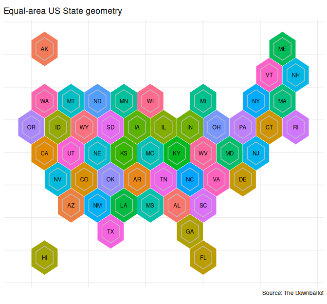

# PresElectionResults

A data package for US Presidential election results.

> All build details are available
> [here](https://github.com/jaytimm/PresElectionResults/blob/master/builds.md),
> and are fully reproducible.

## Installation

``` r
library(dplyr)
```

``` r
devtools::install_github("jaytimm/PresElectionResults")
```

## Presidential Election Results via Britannica

``` r
PresElectionResults::pres_results |>
  tail() |> knitr::kable()
```

| year | candidate       | party      | ec_votes | pop_votes | pop_per | ec_total |
|-----:|:----------------|:-----------|---------:|----------:|--------:|---------:|
| 2016 | Donald Trump    | Republican |      304 |  62984828 |    46.1 |      531 |
| 2016 | Hillary Clinton | Democratic |      227 |  65853514 |    48.2 |      531 |
| 2020 | Joe Biden       | Democratic |      306 |  81283501 |    51.3 |      538 |
| 2020 | Donald Trump    | Republican |      232 |  74223975 |    46.8 |      538 |
| 2024 | Donald Trump    | Republican |      312 |  77302580 |    49.8 |      538 |
| 2024 | Kamala Harris   | Democratic |      226 |  75017613 |    48.3 |      538 |

## Presidential election results by state (1864-2024) via Wikipedia

``` r
PresElectionResults::pres_by_state |>
  head() |> knitr::kable()
```

| year | state_abbrev | winner              | party_win  | democrat | other | republican |
|-----:|:------------|:------------------|:----------|--------:|------:|----------:|
| 1864 | CA           | Abraham Lincoln     | republican |    41.40 |    NA |      58.60 |
| 1864 | DE           | George B. McClellan | democrat   |    51.80 |    NA |      48.20 |
| 1864 | IA           | Abraham Lincoln     | republican |    36.92 |    NA |      63.08 |
| 1864 | IL           | Abraham Lincoln     | republican |    45.60 |    NA |      54.40 |
| 1864 | IN           | Abraham Lincoln     | republican |    46.50 |    NA |      53.50 |
| 1864 | KS           | Abraham Lincoln     | republican |    18.30 |    NA |      81.70 |

## Presidential election results by county (2000-2024) via MIT Election Data and Science Lab (MEDSL)

``` r
PresElectionResults::pres_by_county |>
  head() |> knitr::kable()
```

| year | state_abbrev | county_name | GEOID | winner | party_win | democrat | republican |
|----:|:----------|:----------|:-----|:------------|:---------|-------:|---------:|
| 2000 | AL | Autauga | 01001 | George W. Bush | republican | 28.7 | 69.7 |
| 2000 | AL | Baldwin | 01003 | George W. Bush | republican | 24.8 | 72.4 |
| 2000 | AL | Barbour | 01005 | Al Gore | democrat | 49.9 | 49.0 |
| 2000 | AL | Bibb | 01007 | George W. Bush | republican | 38.2 | 60.2 |
| 2000 | AL | Blount | 01009 | George W. Bush | republican | 27.7 | 70.5 |
| 2000 | AL | Bullock | 01011 | Al Gore | democrat | 69.2 | 29.2 |

## Presidential election results by congressional district (2024)

``` r
PresElectionResults::pres_by_cd |>
  head() |> knitr::kable()
```

| state_abbrev | district_code | house_rep | house_rep_party | winner | party_win | democrat | republican | icpsr |
|:--------|:--------|:-----------|:---------|:--------|:-------|-----:|-------:|----:|
| AK | 00 | Nick Begich | republican | Donald Trump | republican | 41.41 | 54.54 | 21178 |
| AL | 01 | Barry Moore | republican | Donald Trump | republican | 21.89 | 76.94 | 22140 |
| AL | 02 | Shomari Figures | democrat | Kamala Harris | democrat | 53.52 | 45.31 | 21926 |
| AL | 03 | Mike Rogers | republican | Donald Trump | republican | 26.18 | 72.71 | 20301 |
| AL | 04 | Robert B. Aderholt | republican | Donald Trump | republican | 15.96 | 83.02 | 29701 |
| AL | 05 | Dale W. Strong | republican | Donald Trump | republican | 34.20 | 64.02 | 22366 |

## Equal-area simple feature geometries via The Downballot

``` r
library(sf)
library(ggplot2)
PresElectionResults::xsf_TileOutv10 %>% 
  ggplot() + 
  geom_sf(aes(fill = state),
           color = 'white') +
  geom_sf(data = PresElectionResults::xsf_TileInv10, 
          fill = NA, 
          show.legend = F, 
          color="gray", 
          lwd=.5) +
  
  geom_sf_text(data = PresElectionResults::xsf_TileInv10,
                          aes(label = state_abbrev),
                          size = 3,
                          color='black') +
  ##scale_fill_distiller(palette = "RdBu", direction=-1) +
  theme_minimal()+
  theme(axis.text.x=element_blank(),
        axis.text.y=element_blank(),
        axis.title.x=element_blank(),
        axis.title.y=element_blank(),
        legend.position = 'none') +
labs(title = "Equal-area US State geometry",
     caption = "Source: The Downballot")
```



## FRED Historical Population Data (1900-2026)

``` r
PresElectionResults::fred_pop_by_state |>
  head()|>
  knitr::kable()
```

| year | state_abbrev | NAME       | population |
|-----:|:-------------|:-----------|-----------:|
| 1900 | AL           | Alabama    |    1830000 |
| 1900 | AK           | Alaska     |         NA |
| 1900 | AZ           | Arizona    |     124000 |
| 1900 | AR           | Arkansas   |    1314000 |
| 1900 | CA           | California |    1490000 |
| 1900 | CO           | Colorado   |     543000 |
