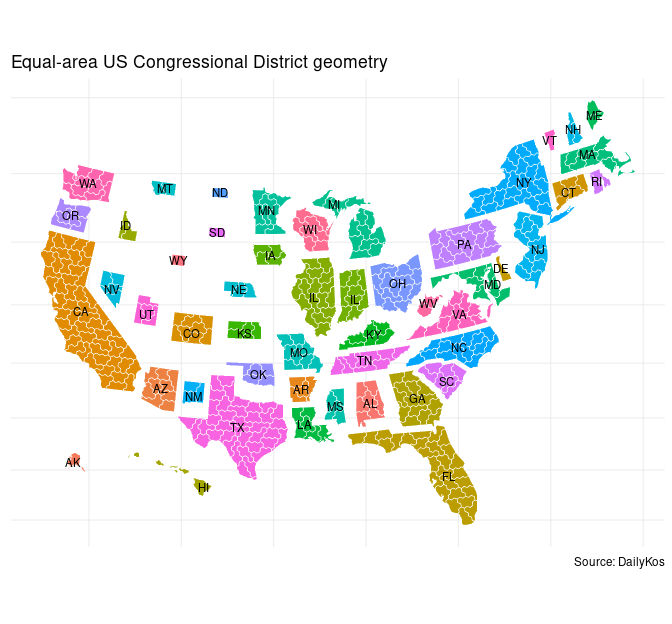

# PresElectionResults

-   [Installation](#installation)
-   [Details](#details)
    -   [Presidential Election Results –
        Britannica](#presidential-election-results----britannica)
    -   [Presidential election results by county (2000-2020) – MIT
        Election Data and Science Lab
        (MEDSL)](#presidential-election-results-by-county-(2000-2020)----mit-election-data-and-science-lab-(medsl))
    -   [Presidential election results by congressional district (2020)
        – Daily
        Kos](#presidential-election-results-by-congressional-district-(2020)----daily-kos)
    -   [Presidential election results by state (1864-) –
        Wikipedia](#presidential-election-results-by-state-(1864-)----wikipedia)
    -   [Equal-area simple feature geometries – Daily
        Kos](#equal-area-simple-feature-geometries----daily-kos)

## Installation

``` r
library(dplyr)
```

``` r
library(devtools)
devtools::install_github("jaytimm/PresElectionResults")
```

## Details

### Presidential Election Results – Britannica

``` r
PresElectionResults::pres_results |>
  tail() |> knitr::kable()
```

| year | candidate       | party      | electoral_votes | popular_votes | popular_percentage |
|-----:|:-------------|:---------|-------------:|------------:|----------------:|
| 2012 | Barack Obama    | Democratic |             332 |      65446032 |               50.9 |
| 2012 | Mitt Romney     | Republican |             206 |      60589084 |               47.1 |
| 2016 | Donald Trump    | Republican |             304 |      62979636 |               46.0 |
| 2016 | Hillary Clinton | Democratic |             227 |      65844610 |               48.1 |
| 2020 | Joe Biden       | Democratic |             306 |      81268924 |               51.3 |
| 2020 | Donald Trump    | Republican |             232 |      74216154 |               46.9 |

### Presidential election results by county (2000-2020) – MIT Election Data and Science Lab (MEDSL)

``` r
PresElectionResults::pres_by_county |>
  head() |> knitr::kable()
```

| year | state_abbrev | county_name | county_fips | winner         | party_win  | democratic | republican |
|----:|:----------|:---------|---------:|:-----------|:--------|--------:|--------:|
| 2000 | AL           | Autauga     |        1001 | George W. Bush | Republican |       28.7 |       69.7 |
| 2000 | AL           | Baldwin     |        1003 | George W. Bush | Republican |       24.8 |       72.4 |
| 2000 | AL           | Barbour     |        1005 | Al Gore        | Democratic |       49.9 |       49.0 |
| 2000 | AL           | Bibb        |        1007 | George W. Bush | Republican |       38.2 |       60.2 |
| 2000 | AL           | Blount      |        1009 | George W. Bush | Republican |       27.7 |       70.5 |
| 2000 | AL           | Bullock     |        1011 | Al Gore        | Democratic |       69.2 |       29.2 |

### Presidential election results by congressional district (2020) – Daily Kos

``` r
PresElectionResults::pres_by_cd |>
  head() |> knitr::kable()
```

| district | house_rep       | house_rep_party | winner       | party_win  | democrat | republican |
|:-------|:-------------|:-------------|:----------|:---------|-------:|---------:|
| AK-AL    | Mary Peltola    | Republican      | Donald Trump | Republican |     43.0 |       53.1 |
| AL-01    | Jerry Carl      | Republican      | Donald Trump | Republican |     35.3 |       63.6 |
| AL-02    | Barry Moore     | Republican      | Donald Trump | Republican |     34.8 |       64.2 |
| AL-03    | Mike Rogers     | Republican      | Donald Trump | Republican |     32.5 |       66.6 |
| AL-04    | Robert Aderholt | Republican      | Donald Trump | Republican |     18.6 |       80.4 |
| AL-05    | Dale Strong     | Republican      | Donald Trump | Republican |     35.6 |       62.7 |

### Presidential election results by state (1864-) – Wikipedia

``` r
PresElectionResults::pres_by_state |>
  head() |> knitr::kable()
```

| year | state_abbrev | winner              | party_win  | democratic | other | republican |
|-----:|:-----------|:-----------------|:----------|----------:|-----:|----------:|
| 1864 | CA           | Abraham Lincoln     | Republican |      41.40 |    NA |      58.60 |
| 1864 | CT           | Abraham Lincoln     | Republican |      48.62 |    NA |      51.38 |
| 1864 | DE           | George B. McClellan | Democratic |      51.80 |    NA |      48.20 |
| 1864 | IA           | Abraham Lincoln     | Republican |      36.92 |    NA |      63.08 |
| 1864 | IL           | Abraham Lincoln     | Republican |      45.60 |    NA |      54.40 |
| 1864 | IN           | Abraham Lincoln     | Republican |      46.50 |    NA |      53.50 |

### Equal-area simple feature geometries – Daily Kos

``` r
# devtools::install_github("yutannihilation/ggsflabel")
library(sf)
library(ggplot2)
PresElectionResults::xsf_HexCDv30wm |> 
  ggplot() + 
  geom_sf(aes(fill = state),
          color = 'white') +

  ggsflabel::geom_sf_text(data = PresElectionResults::xsf_HexSTv30wm,
                          aes(label = state_abbrev),
                          size = 3,
                          color='black') +
  
  ## scale_fill_distiller(palette = "RdBu", direction=-1) +
  theme_minimal()+
  theme(axis.text.x=element_blank(),
        axis.text.y=element_blank(),
        axis.title.x=element_blank(),
        axis.title.y=element_blank(),
        legend.position = 'none') +
labs(title = "Equal-area US Congressional District geometry",
     caption = "Source: DailyKos")
```



``` r
library(sf)
library(ggplot2)
PresElectionResults::xsf_TileOutv10 %>% 
  ggplot() + 
  geom_sf(aes(fill = state),
           color = 'white') +
  geom_sf(data = PresElectionResults::xsf_TileInv10, 
          fill = NA, 
          show.legend = F, 
          color="gray", 
          lwd=.5) +
  ggsflabel::geom_sf_text(data = PresElectionResults::xsf_TileInv10,
                          aes(label = state_abbrev),
                          size = 3,
                          color='black') +
  ##scale_fill_distiller(palette = "RdBu", direction=-1) +
  theme_minimal()+
  theme(axis.text.x=element_blank(),
        axis.text.y=element_blank(),
        axis.title.x=element_blank(),
        axis.title.y=element_blank(),
        legend.position = 'none') +
labs(title = "Equal-area US State geometry",
     caption = "Source: DailyKos")
```


