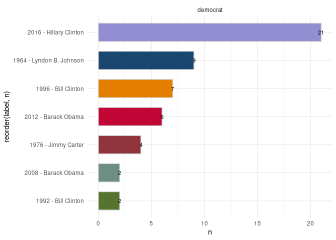
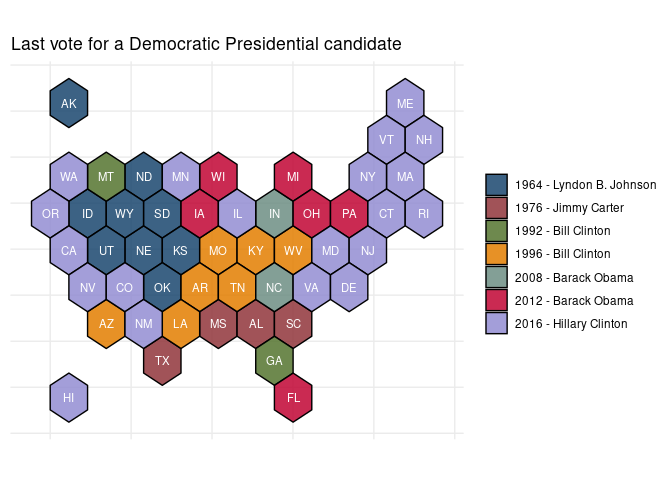
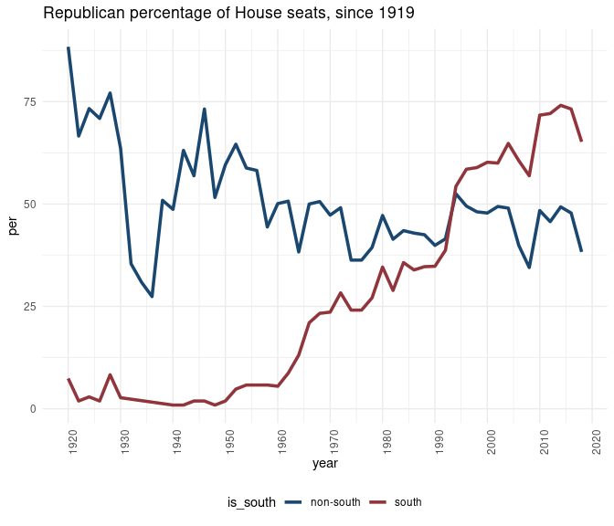
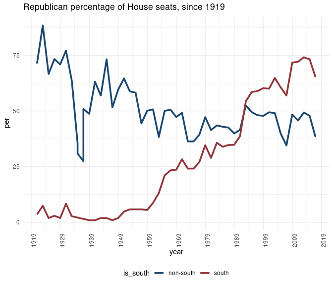
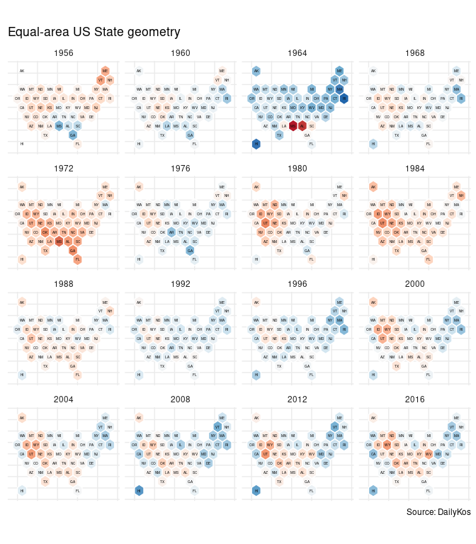
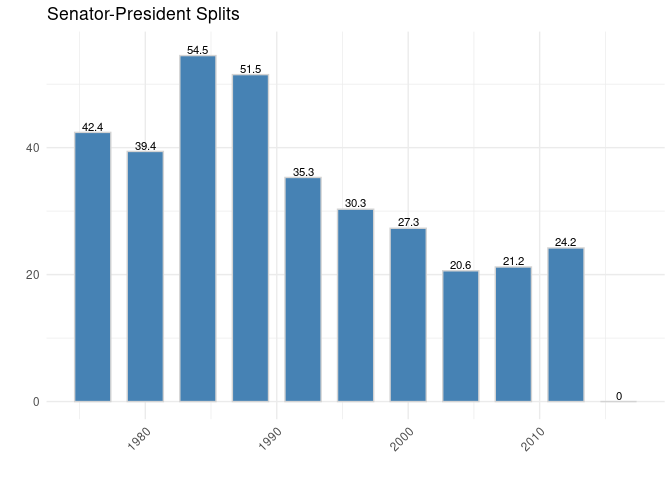
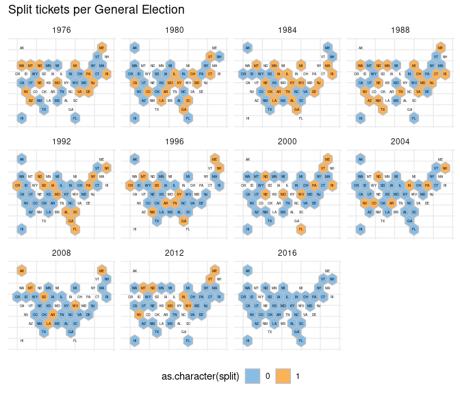
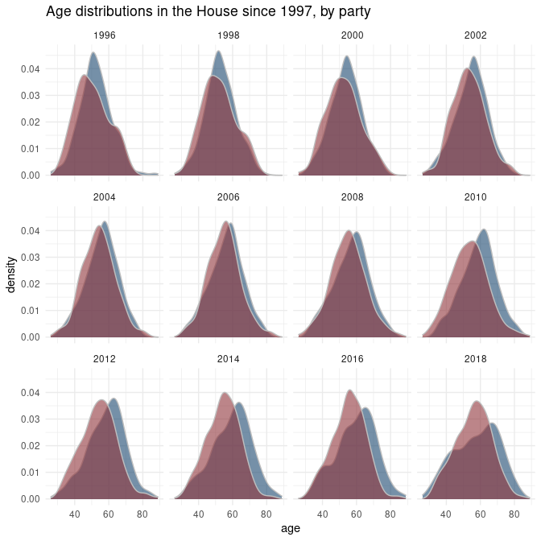
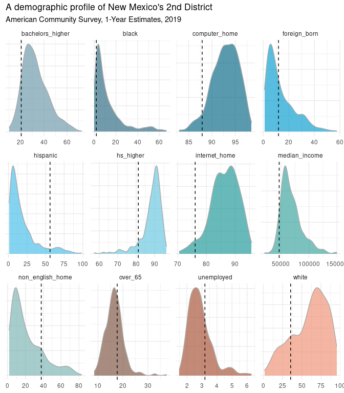

ggplot theme for this one:

``` r
## minimal -- 
theme_polisci_guide <- function (base_size = 11, 
                                 base_family = "", 
                                 base_line_size = base_size/22,
                                 base_rect_size = base_size/22) {
  
  theme_bw(base_size = base_size, 
           base_family = base_family,
           base_line_size = base_line_size, 
           base_rect_size = base_rect_size) %+replace% 
    
    theme(axis.ticks = element_blank(), 
          legend.background = element_blank(),
          legend.key = element_blank(), 
          panel.background = element_blank(),
          panel.border = element_blank(), 
          strip.background = element_blank(),
          plot.background = element_blank(), 
          complete = TRUE)
}
```

VoteView: LEgislation & roll calls
----------------------------------

Fifteen US Senators served in the impeachment trials of both President
Clinton in 1999 and President Trump in 2020. Here we take a quick look
at how they voted using the `Rvoteview` package.

The table below summarizes impeachment roll calls for the two 1999
articles & the two 2020 articles. There was also a resolution to censure
President Clinton. (Note that Mitt Romney (UT) voted in support of
Article I and against Article II in the 2020 impeachment trial of
President Trump.)

``` r
library(tidyverse)

res <- Rvoteview::voteview_search("impeachment") %>%
  filter(chamber == 'Senate' & 
           date %in% c('2020-02-05', '1999-02-12')) %>%
  select(id, date, bill_number, text, question, yea, nay) %>%
  arrange(date) 
```

``` r
res %>%
  select(-id, -bill_number) %>%
  mutate(article = c('-', 'I', 'II', 'II', 'I')) %>%
  arrange(date, article) %>%
  knitr::kable()
```

<table style="width:100%;">
<colgroup>
<col style="width: 6%" />
<col style="width: 70%" />
<col style="width: 12%" />
<col style="width: 2%" />
<col style="width: 2%" />
<col style="width: 4%" />
</colgroup>
<thead>
<tr class="header">
<th style="text-align: left;">date</th>
<th style="text-align: left;">text</th>
<th style="text-align: left;">question</th>
<th style="text-align: right;">yea</th>
<th style="text-align: right;">nay</th>
<th style="text-align: left;">article</th>
</tr>
</thead>
<tbody>
<tr class="odd">
<td style="text-align: left;">1999-02-12</td>
<td style="text-align: left;">A resolution relating to the censure of William Jefferson Clinton.</td>
<td style="text-align: left;">On the Motion</td>
<td style="text-align: right;">43</td>
<td style="text-align: right;">56</td>
<td style="text-align: left;">-</td>
</tr>
<tr class="even">
<td style="text-align: left;">1999-02-12</td>
<td style="text-align: left;">A resolution impeaching William Jefferson Clinton, President of the United States, for high crimes and misdemeanors.</td>
<td style="text-align: left;">Guilty or Not Guilty</td>
<td style="text-align: right;">50</td>
<td style="text-align: right;">51</td>
<td style="text-align: left;">I</td>
</tr>
<tr class="odd">
<td style="text-align: left;">1999-02-12</td>
<td style="text-align: left;">A resolution impeaching William Jefferson Clinton, President of the United States, for high crimes and misdemeanors.</td>
<td style="text-align: left;">Guilty or Not Guilty</td>
<td style="text-align: right;">45</td>
<td style="text-align: right;">56</td>
<td style="text-align: left;">II</td>
</tr>
<tr class="even">
<td style="text-align: left;">2020-02-05</td>
<td style="text-align: left;">A resolution impeaching Donald John Trump, President of the United States, for high crimes and misdemeanors.</td>
<td style="text-align: left;">Guilty or Not Guilty</td>
<td style="text-align: right;">47</td>
<td style="text-align: right;">53</td>
<td style="text-align: left;">I</td>
</tr>
<tr class="odd">
<td style="text-align: left;">2020-02-05</td>
<td style="text-align: left;">A resolution impeaching Donald John Trump, President of the United States, for high crimes and misdemeanors.</td>
<td style="text-align: left;">Guilty or Not Guilty</td>
<td style="text-align: right;">48</td>
<td style="text-align: right;">52</td>
<td style="text-align: left;">II</td>
</tr>
</tbody>
</table>

Here we look at how the 15 US Senators – members of both the 106th &
116th congresses – voted on Article I from the 2020 trial and Article II
of the 1999 trial.

``` r
votes <- Rvoteview::voteview_download(res$id)
```

``` r
sens <- Rvoteview:: member_search(chamber= 'Senate', 
                                  congress = c(106, 116))  
## re-do this piece --         

votes$votes.long %>% 
  inner_join(sens %>% 
               mutate(icpsr = as.character(icpsr))) %>%
  filter(vname %in% c('RS1060018', 'RS1160461')) %>%
  select(bioname, state_abbrev, 
         congress, party_name, vote) %>%
  mutate(vote = ifelse(vote == 1, 'Yea', 'Nay')) %>%
  spread(congress, vote) %>%
  filter(complete.cases(.)) %>%
  arrange(party_name, `106`) %>%
  knitr::kable()
```

| bioname                             | state\_abbrev | party\_name      | 106 | 116 |
|:------------------------------------|:--------------|:-----------------|:----|:----|
| DURBIN, Richard Joseph              | IL            | Democratic Party | Nay | Yea |
| FEINSTEIN, Dianne                   | CA            | Democratic Party | Nay | Yea |
| LEAHY, Patrick Joseph               | VT            | Democratic Party | Nay | Yea |
| MURRAY, Patty                       | WA            | Democratic Party | Nay | Yea |
| REED, John F. (Jack)                | RI            | Democratic Party | Nay | Yea |
| SCHUMER, Charles Ellis (Chuck)      | NY            | Democratic Party | Nay | Yea |
| WYDEN, Ronald Lee                   | OR            | Democratic Party | Nay | Yea |
| COLLINS, Susan Margaret             | ME            | Republican Party | Nay | Nay |
| CRAPO, Michael Dean                 | ID            | Republican Party | Yea | Nay |
| ENZI, Michael B.                    | WY            | Republican Party | Yea | Nay |
| GRASSLEY, Charles Ernest            | IA            | Republican Party | Yea | Nay |
| INHOFE, James Mountain              | OK            | Republican Party | Yea | Nay |
| McCONNELL, Addison Mitchell (Mitch) | KY            | Republican Party | Yea | Nay |
| ROBERTS, Charles Patrick (Pat)      | KS            | Republican Party | Yea | Nay |
| SHELBY, Richard C.                  | AL            | Republican Party | Yea | Nay |

################ 

Historical presidential election results
----------------------------------------

``` r
last_dem <- uspols::uspols_wiki_pres %>%
  #filter(party_win == 'democrat') %>% 
  group_by(state_abbrev, party_win) %>%
  filter(year == max(year)) %>%
  ungroup() %>%
  mutate(label = paste0(year, ' - ', winner))
```

**Nine US states** have not voted for a Democratic Presidential
candidate since LBJ. So, roughly 1/5 of the country (here, of total
states) hasn’t voted for a Democrat since LBJ –

``` r
last_dem %>%
  group_by(party_win, label) %>%
  summarise(n = n()) %>%
  ungroup() %>%
  arrange(party_win, desc(n)) %>%
  filter(party_win == 'democrat') %>% 
  
      ggplot(aes(x = reorder(label,n), 
               y = n, 
               fill = label, 
               label = n)) + 
  
    geom_col(width=.65, color = 'lightgray') +  
    geom_text(size = 3, nudge_y = .5) +
    coord_flip()+
    #labs(title = "Roll call results for legislation referencing HEALTH CARE") +
    theme_minimal()+
    ggthemes::scale_fill_economist()+
    xlab('') + ylab('') +
    theme(legend.position = "none")+
    facet_wrap(~party_win, ncol = 2) 
```



``` r
library(sf)

uspols::xsf_TileOutv10 %>% 
  left_join(last_dem %>%
              filter(party_win == 'democrat'), by ='state_abbrev') %>%
  
  ggplot() + 
  geom_sf(aes(fill = label),
          color = 'white' , 
          alpha = .85) + 
  
  ggsflabel::geom_sf_text(data = uspols::xsf_TileInv10,
                          aes(label = state_abbrev), 
                          size = 3,
                          color = 'white') +
  theme_minimal() +
  ggthemes::scale_fill_economist()+
  theme(axis.title.x=element_blank(),  ## add a simple theme --
        axis.text.x=element_blank(),
        axis.title.y=element_blank(),
        axis.text.y=element_blank(),
        legend.title=element_blank(),
        legend.position = 'right') +
  labs(title = "Last vote for a Democratic Presidential candidate")
```



######### 

The south = Dixie + KE & OK
---------------------------

``` r
library(tidyverse)
south <- c('SC', 'MS', 'FL', 
           'AL', 'GA', 'LA', 'TX', 
           'VA', 'AR', 'NC', 'TE',
           'OK', 'KE')
```

Rvoteview: House composition
----------------------------

*Obviously do this the once* –

``` r
vvo <- Rvoteview::download_metadata(type = 'members', chamber = 'house') %>%
  filter(congress > 66 & chamber != 'President')
```

    ## [1] "/tmp/RtmpOnzy4J/Hall_members.csv"

``` r
house <- vvo %>%
  
  # lapply(c(66:116), function (x)
  #                   Rvoteview::member_search (
  #                     chamber = 'House', 
  #                     congress = x)) %>% 
  bind_rows() %>%
    mutate(x = length(unique(district_code))) %>%
    ungroup() %>%
    mutate(district_code = ifelse(x==1, 0, district_code)) %>%
    mutate(district_code = 
             stringr::str_pad (as.numeric(district_code), 
                               2, pad = 0),
           party_code = as.character(party_code)) %>%
  left_join(data.frame(year = c(1918 + 2*rep(c(1:50))), 
                       ## NOTE: election years.  term begins year + 1
                       congress = c(67:116)), by = 'congress') 
```

Southern states versus non-Southern states
------------------------------------------

\~75% of GOP House members are from Dixie. In 1960, this % was less than
10.

``` r
house %>%
  mutate(is_south = ifelse(state_abbrev %in% south, 
                           'south', 'non-south')) %>%
  group_by(year, is_south, party_code) %>%
  summarize (n = n()) %>%
  group_by(year, is_south) %>%
  
  mutate(per = round(n/sum(n)*100, 1)) %>%
  filter(party_code == '200') %>%
  ungroup() %>%
  
  ggplot() +
  geom_line(aes(x = year, y= per, color = is_south), size = 1.25) +
  ggthemes::scale_color_stata()+
  theme_minimal() +
  theme(legend.position = 'bottom',
        axis.text.x = element_text(angle = 90, hjust = 1)) +
  scale_x_continuous(breaks=seq(1920,2020,10)) +
  labs(title="Republican percentage of House seats, since 1919") 
```



A comparison of ideal points for members of the 111th, 113th & 115th
Houses & Presidential vote margins for the 2008, 2012 & 2016 elections,
respectively. Plots re-created, in part, from Barber & McCarty (2015).

Two observations/points to the plot below:

``` r
uspols::uspols_dk_pres %>%
  mutate(margin = republican - democrat) %>%
  
  left_join(house %>% filter(congress %in% c('111', '113', '115')), 
            by = c('year', 'state_abbrev', 'district_code')) %>%
  
  
  ggplot(aes(y = nominate_dim1, 
             x = margin, 
             color = party_code))+ 
  
  geom_point()+ #
  geom_smooth(method="lm", se=T) +
  ggthemes::scale_color_stata()+
  theme_minimal() +
  theme(legend.position = "none", 
        plot.title = element_text(size=12),
        axis.title = element_text())+
  facet_wrap(~year, nrow = 1) +
  xlab('Margins') + ylab('DW-Nominate D1') +
  labs(title="Presidential Election Margins & DW-Nominate scores")
```



################## 

Founding fathers —

1.  A relevant correspondence –

An excerpt from this letter sent by Alexander Hamilton to George
Washington on 1792-08-18, and quoted by Representative Adam Schiff on
2020-1-22 during the impeachment trial of Donald J. Trump. Accessed here
via this Git Hub resource that makes the Founders Online database of
writings/correspondances available as a collection of RDS files.

An excerpt from this letter sent by Alexander Hamilton to George
Washington on 1792-08-18, and quoted by Representative Adam Schiff on
2020-1-22 during the impeachment trial of Donald J. Trump. Accessed here
via this Git Hub resource that makes the Founders Online database of
writings/correspondances available as a collection of RDS files.

``` r
ffc_dir <- '/home/jtimm/jt_work/GitHub/git_projects/FoundersArchiveCorpus/data/'
```

``` r
setwd(ffc_dir)
gfiles <- list.files(path = ffc_dir, 
                     pattern = "rds", 
                     recursive = TRUE) 

ffc_washington <- readRDS(gfiles[8])

ah <- ffc_washington %>% 
  filter(grepl('No popular Government was ever without its Catalines', og_text))

ah1 <- strsplit(ah$og_text, 'Yet it would not be difficult to lay the finger upon some of their party who may justly be suspected.')[[1]][2]

ah2 <- strsplit(ah1, 'It has aptly been observed that Cato was the Tory-Cæsar the whig of his day. ')[[1]][1]
```

> When a man unprincipled in private life desperate in his fortune, bold
> in his temper, possessed of considerable talents, having the advantage
> of military habits—despotic in his ordinary demeanour—known to have
> scoffed in private at the principles of liberty—when such a man is
> seen to mount the hobby horse of popularity—to join in the cry of
> danger to liberty—to take every opportunity of embarrassing the
> General Government & bringing it under suspicion—to flatter and fall
> in with all the non sense of the zealots of the day—It may justly be
> suspected that his object is to throw things into confusion that he
> may “ride the storm and direct the whirlwind.”

1.  search using `quicknews` –

``` r
qorp <- quanteda::corpus(ffc_washington)
#quanteda::docnames(qorp) <- korpus$status_id

quicknews::qnews_search_contexts(qorp = qorp, 
                                        search = "federal government", 
                                        window = 10,
                                        highlight_color = '|') %>%
  #left_join(metas, by = c('docname' = 'link')) %>%
  select(docname, context) %>%
  sample_n(7)  %>%
  knitr::kable(caption = 'Search-in-context: COVID-19 & coronavirus')
```

<table>
<caption>Search-in-context: COVID-19 &amp; coronavirus</caption>
<colgroup>
<col style="width: 6%" />
<col style="width: 93%" />
</colgroup>
<thead>
<tr class="header">
<th style="text-align: left;">docname</th>
<th style="text-align: left;">context</th>
</tr>
</thead>
<tbody>
<tr class="odd">
<td style="text-align: left;">text10400</td>
<td style="text-align: left;">… prays to be continued in the same Office under the <code>Federal Government</code> , Or be appointed one of the land or Tide …</td>
</tr>
<tr class="even">
<td style="text-align: left;">text26670</td>
<td style="text-align: left;">… . I have always imagined that the resolution of the <code>federal government</code> to restore vessels , captured by the privateers , fitted …</td>
</tr>
<tr class="odd">
<td style="text-align: left;">text12025</td>
<td style="text-align: left;">… active friend of the late Revolution , &amp; the present <code>federal Government</code> , and that although I have not had the honor …</td>
</tr>
<tr class="even">
<td style="text-align: left;">text20598</td>
<td style="text-align: left;">… be lodged in this or in that Department of the <code>Federal Government</code> . And we find it expressly vested in the Legislative …</td>
</tr>
<tr class="odd">
<td style="text-align: left;">text2104</td>
<td style="text-align: left;">… ? or was the State Government the Horse and the <code>federal Government</code> the Cart ? or was the Town the Horse &amp; …</td>
</tr>
<tr class="even">
<td style="text-align: left;">text19091</td>
<td style="text-align: left;">… part of our fellow citizens ; the friends of the <code>federal government</code> will evince that spirit of deference and concession for which …</td>
</tr>
<tr class="odd">
<td style="text-align: left;">text19744</td>
<td style="text-align: left;">… rights of the people ; over the authorities of the <code>confederal government</code> ; and over both the rights and the authorities of …</td>
</tr>
</tbody>
</table>

Presidential elections historically –
-------------------------------------

``` r
uspols::xsf_TileOutv10 %>%
  left_join(uspols::uspols_wiki_pres %>%
              filter(year > 1955) %>%
              mutate(margins = republican - democrat)) %>% 
  ggplot() + 
  geom_sf(aes(fill = margins),
           color = 'white') +
  geom_sf(data = uspols::xsf_TileInv10, 
          fill = NA, 
          show.legend = F, 
          color = NA, 
          lwd=.5) +
  ggsflabel::geom_sf_text(data = uspols::xsf_TileInv10,
                          aes(label = state_abbrev),
                          size = 1.25,
                          color='black') +
  scale_fill_distiller(palette = "RdBu", direction=-1) +
  facet_wrap(~year) +
  theme_minimal()+
  theme(axis.text.x=element_blank(),
        axis.text.y=element_blank(),
        axis.title.x=element_blank(),
        axis.title.y=element_blank(),
        legend.position = 'none') +
labs(title = "Equal-area US State geometry",
     caption = "Source: DailyKos")
```



### Split ticket voting –

Here, per presidential election, Party Senator !- Party President –

Split means that folks from a given state sent a Senator from party X to
the senate and sent electoral votes to President from party Y.

``` r
splits <- uspols::uspols_wiki_pres %>% 
  rename(party_pres = party_win) %>%
  filter(year >= 1976) %>%
  select(year, state_abbrev, party_pres) %>%
  inner_join(uspols::uspols_medsl_senate, 
         by = c('year', 'state_abbrev')) %>%
  mutate(split = ifelse(party_pres != party_win, 1, 0)) 

splits %>%
  group_by(year) %>%
  summarize(per_split = round(mean(split)*100, 1)) %>%
  
        ggplot(aes(x = year, 
               y = per_split, 
               label = per_split)) + 
  
    geom_col(width = 2.75, fill = 'steelblue',  color = 'lightgray') +  
    geom_text(size = 3, nudge_y = 1) +
    labs(title = "Senator-President Splits") +
    theme_minimal()+
    ggthemes::scale_fill_stata() +
    scale_x_continuous(breaks=seq(1976,2016,4)) +
  ylab('') + xlab('') +
    theme(legend.position = "none",
          axis.text.x = element_text(angle = 45, hjust = 1))
```



Mapping splits quickly – need to add CLASS information – !!

And change dark blue color – sos to see – !! and note that no
distinctions are made here wrt party affiliation – Although a simple
cross-tab/typology will show – !!

``` r
uspols::xsf_TileOutv10 %>%
  left_join(splits, by = 'state_abbrev') %>% 
  ggplot() + 
  geom_sf(aes(fill = as.character(split)),
           color = 'gray') +
  geom_sf(data = uspols::xsf_TileInv10, 
          fill = NA, 
          show.legend = F, 
          color = NA, 
          lwd=.5) +
  ggsflabel::geom_sf_text(data = uspols::xsf_TileInv10,
                          aes(label = state_abbrev),
                          size = 1.25,
                          color='black') +
  #scale_fill_distiller(palette = "RdBu", direction=-1) +
  ggthemes::scale_fill_few () + 
  facet_wrap(~year) +
  theme_minimal()+
  theme(axis.text.x=element_blank(),
        axis.text.y=element_blank(),
        axis.title.x=element_blank(),
        axis.title.y=element_blank(),
        legend.position = 'bottom') +
labs(title = "Split tickets per General Election")
```



Age – briefly –
---------------

``` r
house %>%
  mutate(age = year - born) %>%
  filter (party_code %in% c('100', '200'), year > 1995) %>% ## 100 == democrat --
  ggplot(aes(age, 
             fill = party_code)) +

  ggthemes::scale_fill_stata()+
  theme_minimal() +
  geom_density(alpha = 0.6, color = 'gray') +
  facet_wrap(~year)+

  labs(title="Age distributions in the House since 1997, by party") +
  theme(legend.position = "none")
```



### Profiling congressional districts via census data

``` r
tidycensus::census_api_key("b508704c99f3ae9bc5b5e7c41e3dd77e59d52722")
```

    ## To install your API key for use in future sessions, run this function with `install = TRUE`.

``` r
Sys.getenv("CENSUS_API_KEY")
```

    ## [1] "b508704c99f3ae9bc5b5e7c41e3dd77e59d52722"

``` r
library(tigris); options(tigris_use_cache = TRUE, tigris_class = "sf")
```

    ## To enable 
    ## caching of data, set `options(tigris_use_cache = TRUE)` in your R script or .Rprofile.

``` r
nonx <- c('78', '69', '66', '72', '60', '15', '02')

states <- tigris::states(cb = TRUE) %>%
  data.frame() %>%
  select(STATEFP, STUSPS) %>%
  rename(state_code = STATEFP, state_abbrev = STUSPS)
```

``` r
x <- tidycensus::load_variables(year = '2019', dataset = "acs1/profile")
```

``` r
#Define census query
variable_list <-  c(bachelors_higher = 'DP02_0068P',
                    foreign_born = 'DP02_0093P',
                    hispanic = 'DP05_0071P',
                    median_income = 'DP03_0062',
                    unemployed = 'DP03_0005P',
                    white = 'DP05_0077P',
                    black = 'DP05_0078P',
                    over_65 = 'DP05_0024P',
                    hs_higher = 'DP02_0067P',
                    non_english_home = 'DP02_0113P',
                    computer_home = 'DP02_0152P',
                    internet_home = 'DP02_0153P')


#Pull some general dems from profile tables
gen <-  tidycensus::get_acs(geography = 'congressional district',
                            variables = variable_list,
                            year = 2019,
                            survey = 'acs1',
                            geometry = F) %>%
  mutate(state_code = substr(GEOID, 1, 2),
         district_code = substr(GEOID, 3, 4)) %>%
  left_join(states, by = c('state_code')) %>%
  select(state_abbrev, district_code, variable, estimate, moe)
```

    ## Getting data from the 2019 1-year ACS

    ## The one-year ACS provides data for geographies with populations of 65,000 and greater.

    ## Using the ACS Data Profile

``` r
base_viz <- gen %>% 
  ggplot( aes(estimate, fill = variable)) +
  geom_density(alpha = 0.65,
               color = 'darkgray',
               adjust = 1) +
  scale_fill_manual(values = 
                      colorRampPalette(ggthemes::economist_pal()(8))(12)) +
  facet_wrap(~variable, scale = 'free', ncol = 4)+
  theme_minimal() +
  theme(legend.position = "none",
        axis.text.y=element_blank(),
        axis.title.x=element_blank(),
        axis.title.y=element_blank())

nm02 <- gen %>% 
  filter(state_abbrev == 'NM' & district_code == '02') 

base_viz + 
  geom_vline (data = nm02, 
              aes(xintercept=estimate),
              linetype = 2) +
  labs(title = "A demographic profile of New Mexico's 2nd District",
       subtitle = 'American Community Survey, 1-Year Estimates, 2019')
```



References
----------

Barber, M., & McCarty, N. (2015). Causes and consequences of
polarization. *Political negotiation: A handbook*, 37, 39-43.

McCarty, Nolan, Keith T Poole, and Howard Rosenthal. 2016. *Polarized
America: The Dance of Ideology and Unequal Riches*. mit Press.
