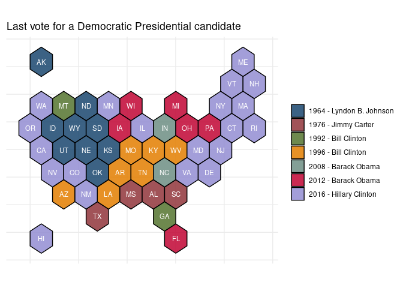
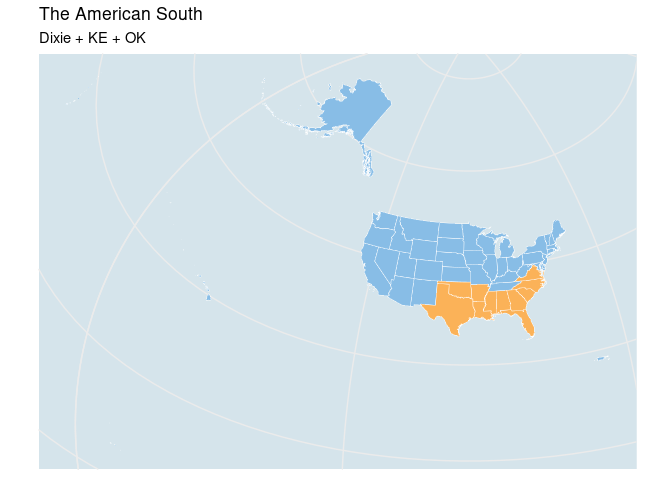

VoteView: LEgislation & roll calls
----------------------------------

Fifteen US Senators served in the impeachment trials of both President
Clinton in 1999 and President Trump in 2020. Here we take a quick look
at how they voted using the `Rvoteview` package.

The table below summarizes impeachment roll calls for the two 1999
articles & the two 2020 articles. There was also a resolution to censure
President Clinton. (Note that Mitt Romney (UT) voted in support of
Article I and against Article II in the 2020 impeachment trial of
President Trump.)

``` r
#options(knitr.table.format = "latex")
```

``` r
library(tidyverse)

res <- Rvoteview::voteview_search("impeachment") %>%
  filter(chamber == 'Senate' & 
           date %in% c('2020-02-05', '1999-02-12')) %>%
  select(id, date, bill_number, text, question, yea, nay) %>%
  arrange(date) 
```

``` r
#library(kableExtra)
res %>%
  select(-id) %>%
  mutate(article = c('-', 'I', 'II', 'II', 'I')) %>%
  arrange(date, article) %>%
  knitr::kable()
```

<table>
<colgroup>
<col style="width: 6%" />
<col style="width: 6%" />
<col style="width: 66%" />
<col style="width: 11%" />
<col style="width: 2%" />
<col style="width: 2%" />
<col style="width: 4%" />
</colgroup>
<thead>
<tr class="header">
<th style="text-align: left;">date</th>
<th style="text-align: left;">bill_number</th>
<th style="text-align: left;">text</th>
<th style="text-align: left;">question</th>
<th style="text-align: right;">yea</th>
<th style="text-align: right;">nay</th>
<th style="text-align: left;">article</th>
</tr>
</thead>
<tbody>
<tr class="odd">
<td style="text-align: left;">1999-02-12</td>
<td style="text-align: left;">SRES44</td>
<td style="text-align: left;">A resolution relating to the censure of William Jefferson Clinton.</td>
<td style="text-align: left;">On the Motion</td>
<td style="text-align: right;">43</td>
<td style="text-align: right;">56</td>
<td style="text-align: left;">-</td>
</tr>
<tr class="even">
<td style="text-align: left;">1999-02-12</td>
<td style="text-align: left;">HRES611</td>
<td style="text-align: left;">A resolution impeaching William Jefferson Clinton, President of the United States, for high crimes and misdemeanors.</td>
<td style="text-align: left;">Guilty or Not Guilty</td>
<td style="text-align: right;">50</td>
<td style="text-align: right;">51</td>
<td style="text-align: left;">I</td>
</tr>
<tr class="odd">
<td style="text-align: left;">1999-02-12</td>
<td style="text-align: left;">HRES611</td>
<td style="text-align: left;">A resolution impeaching William Jefferson Clinton, President of the United States, for high crimes and misdemeanors.</td>
<td style="text-align: left;">Guilty or Not Guilty</td>
<td style="text-align: right;">45</td>
<td style="text-align: right;">56</td>
<td style="text-align: left;">II</td>
</tr>
<tr class="even">
<td style="text-align: left;">2020-02-05</td>
<td style="text-align: left;">HRES755</td>
<td style="text-align: left;">A resolution impeaching Donald John Trump, President of the United States, for high crimes and misdemeanors.</td>
<td style="text-align: left;">Guilty or Not Guilty</td>
<td style="text-align: right;">47</td>
<td style="text-align: right;">53</td>
<td style="text-align: left;">I</td>
</tr>
<tr class="odd">
<td style="text-align: left;">2020-02-05</td>
<td style="text-align: left;">HRES755</td>
<td style="text-align: left;">A resolution impeaching Donald John Trump, President of the United States, for high crimes and misdemeanors.</td>
<td style="text-align: left;">Guilty or Not Guilty</td>
<td style="text-align: right;">48</td>
<td style="text-align: right;">52</td>
<td style="text-align: left;">II</td>
</tr>
</tbody>
</table>

Here we look at how the 15 US Senators – members of both the 106th &
116th congresses – voted on Article I from the 2020 trial and Article II
of the 1999 trial.

``` r
votes <- Rvoteview::voteview_download(res$id)
```

``` r
sens <- Rvoteview:: member_search(chamber= 'Senate', 
                                  congress = c(106, 116))  
## re-do this piece --         

votes$votes.long %>% 
  inner_join(sens %>% 
               mutate(icpsr = as.character(icpsr))) %>%
  filter(vname %in% c('RS1060018', 'RS1160461')) %>%
  select(bioname, state_abbrev, 
         congress, party_name, vote) %>%
  mutate(vote = ifelse(vote == 1, 'Yea', 'Nay')) %>%
  spread(congress, vote) %>%
  filter(complete.cases(.)) %>%
  arrange(party_name, `106`) %>%
  knitr::kable()
```

| bioname                             | state\_abbrev | party\_name      | 106 | 116 |
|:------------------------------------|:--------------|:-----------------|:----|:----|
| DURBIN, Richard Joseph              | IL            | Democratic Party | Nay | Yea |
| FEINSTEIN, Dianne                   | CA            | Democratic Party | Nay | Yea |
| LEAHY, Patrick Joseph               | VT            | Democratic Party | Nay | Yea |
| MURRAY, Patty                       | WA            | Democratic Party | Nay | Yea |
| REED, John F. (Jack)                | RI            | Democratic Party | Nay | Yea |
| SCHUMER, Charles Ellis (Chuck)      | NY            | Democratic Party | Nay | Yea |
| WYDEN, Ronald Lee                   | OR            | Democratic Party | Nay | Yea |
| COLLINS, Susan Margaret             | ME            | Republican Party | Nay | Nay |
| CRAPO, Michael Dean                 | ID            | Republican Party | Yea | Nay |
| ENZI, Michael B.                    | WY            | Republican Party | Yea | Nay |
| GRASSLEY, Charles Ernest            | IA            | Republican Party | Yea | Nay |
| INHOFE, James Mountain              | OK            | Republican Party | Yea | Nay |
| McCONNELL, Addison Mitchell (Mitch) | KY            | Republican Party | Yea | Nay |
| ROBERTS, Charles Patrick (Pat)      | KS            | Republican Party | Yea | Nay |
| SHELBY, Richard C.                  | AL            | Republican Party | Yea | Nay |

################ 

Historical presidential election results
----------------------------------------

``` r
last_dem <- uspols::uspols_wiki_pres %>%
  #filter(party_win == 'democrat') %>% 
  group_by(state_abbrev, party_win) %>%
  filter(year == max(year)) %>%
  ungroup() %>%
  mutate(label = paste0(year, ' - ', winner))
```

**Nine US states** have not voted for a Democratic Presidential
candidate since LBJ. So, roughly 1/5 of the country (here, of total
states) hasn’t voted for a Democrat since LBJ –

``` r
last_dem %>%
  #filter(party_win == 'democrat') %>%
  group_by(year, party_win, winner) %>%
  summarise(n = n()) %>%
  ungroup() %>%
  arrange(party_win, desc(n)) %>%
  mutate(party_win = paste0('`', party_win, '`')) %>%
  knitr::kable(escape = F)
```

|  year| party\_win   | winner            |    n|
|-----:|:-------------|:------------------|----:|
|  2016| `democrat`   | Hillary Clinton   |   21|
|  1964| `democrat`   | Lyndon B. Johnson |    9|
|  1996| `democrat`   | Bill Clinton      |    7|
|  2012| `democrat`   | Barack Obama      |    6|
|  1976| `democrat`   | Jimmy Carter      |    4|
|  1992| `democrat`   | Bill Clinton      |    2|
|  2008| `democrat`   | Barack Obama      |    2|
|  2016| `republican` | Donald Trump      |   30|
|  1988| `republican` | George H. W. Bush |    8|
|  1984| `republican` | Ronald Reagan     |    6|
|  2004| `republican` | George W. Bush    |    4|
|  1972| `republican` | Richard Nixon     |    1|
|  2000| `republican` | George W. Bush    |    1|

``` r
library(sf)

uspols::xsf_TileOutv10 %>% 
  left_join(last_dem %>%
              filter(party_win == 'democrat'), by ='state_abbrev') %>%
  
  ggplot() + 
  geom_sf(aes(fill = label),
          color = 'black' , 
          alpha = .85) + 
  
  ggsflabel::geom_sf_text(data = uspols::xsf_TileInv10,
                          aes(label = state_abbrev), 
                          size = 3,
                          color = 'white') +
  theme_minimal() +
  ggthemes::scale_fill_stata() +
  theme(axis.title.x=element_blank(),  ## add a simple theme --
        axis.text.x=element_blank(),
        axis.title.y=element_blank(),
        axis.text.y=element_blank(),
        legend.title=element_blank(),
        legend.position = 'right') +
  labs(title = "Last vote for a Democratic Presidential candidate")
```



######### 

The south = Dixie + KE & OK
---------------------------

``` r
library(tidyverse)
south <- c('SC', 'MS', 'FL', 
           'AL', 'GA', 'LA', 'TX', 
           'VA', 'AR', 'NC', 'TE',
           'OK', 'KE')
```

Rvoteview: House composition
----------------------------

*Obviously do this the once* –

``` r
house <- lapply(c(66:116), function (x)
                    Rvoteview::member_search (
                      chamber = 'House', 
                      congress = x)) %>% 
  bind_rows() %>%
    mutate(x = length(unique(district_code))) %>%
    ungroup() %>%
    mutate(district_code = ifelse(x==1, 0, district_code)) %>%
    mutate(district_code = stringr::str_pad (as.numeric(district_code), 2, pad = 0)) 
```

Southern states versus non-Southern states
------------------------------------------

\~75% of GOP House members are from Dixie. In 1960, this % was less than
10.

``` r
house %>%
  mutate(is_south = ifelse(state_abbrev %in% south, 
                           'south', 'non-south')) %>%
  group_by(congress, is_south, party_name) %>%
  summarize (n = n()) %>%
  group_by(congress, is_south) %>%
  
  mutate(per = round(n/sum(n)*100, 1)) %>%
  filter(party_name == 'Republican Party') %>%
  ungroup() %>%
  mutate(year = 1919 + 2*rep(c(1:49), each = 2)) %>%
  
  ggplot() +
  geom_line(aes(x = year, y= per, color = is_south), size = 1.25) +
  ggthemes::scale_color_stata()+
  theme_minimal() +
  theme(legend.position = 'bottom',
        axis.text.x = element_text(angle = 90, hjust = 1)) +
  scale_x_continuous(breaks=seq(1919,2019,10)) +
  labs(title="Republican percentage of House seats, since 1919") 
```


A comparison of ideal points for members of the 111th, 113th & 115th
Houses & Presidential vote margins for the 2008, 2012 & 2016 elections,
respectively. Plots re-created, in part, from Barber & McCarty (2015).

Two observations/points to the plot below:

``` r
uspols::uspols_dk_pres %>%
  mutate(margin = republican - democrat,
         congress = case_when(year == 2008 ~ 111, 
                              year == 2012 ~ 113,
                              year == 2016 ~ 115)) %>%
  
  left_join(house %>% filter(congress %in% c('111', '113', '115')), 
            by = c('congress', 'state_abbrev', 'district_code')) %>%
  
  
  ggplot(aes(y = nominate.dim1, 
             x = margin, 
             color = as.factor(party_name)))+ 
  
  geom_point()+ #
  geom_smooth(method="lm", se=T) +
  ggthemes::scale_color_stata()+
  theme_minimal() +
  theme(legend.position = "none", 
        plot.title = element_text(size=12),
        axis.title = element_text())+
  facet_wrap(~year, nrow = 1) +
  xlab('Margins') + ylab('DW-Nominate D1') +
  labs(title="Presidential Election Margins & DW-Nominate scores")
```



################## 

Founding fathers —

1.  A relevant correspondance –

An excerpt from this letter sent by Alexander Hamilton to George
Washington on 1792-08-18, and quoted by Representative Adam Schiff on
2020-1-22 during the impeachment trial of Donald J. Trump. Accessed here
via this Git Hub resource that makes the Founders Online database of
writings/correspondances available as a collection of RDS files.

An excerpt from this letter sent by Alexander Hamilton to George
Washington on 1792-08-18, and quoted by Representative Adam Schiff on
2020-1-22 during the impeachment trial of Donald J. Trump. Accessed here
via this Git Hub resource that makes the Founders Online database of
writings/correspondances available as a collection of RDS files.

``` r
ffc_dir <- '/home/jtimm/jt_work/GitHub/git_projects/FoundersArchiveCorpus/data/'
```

``` r
setwd(ffc_dir)
gfiles <- list.files(path = ffc_dir, 
                     pattern = "rds", 
                     recursive = TRUE) 

ffc_washington <- readRDS(gfiles[8])

ah <- ffc_washington %>% 
  filter(grepl('No popular Government was ever without its Catalines', og_text))

ah1 <- strsplit(ah$og_text, 'absurdity refutes itself.\n')[[1]][2]
ah2 <- strsplit(ah1, 'Objection the 15')[[1]][1]

ah3 <- gsub('When a man unprincipled', '**When a man unprincipled', ah2)
ah3 <- gsub('whirlwind', 'whirlwind**', ah3)
ah3 <- gsub('\n\n', '\n', ah3)
ah3 <- gsub('\n', '\n>\n', ah3)
ah3 <- paste('>', gsub(' *(\n*)*$', '\\1', ah3))
```

1.  search using `quicknews` –

``` r
qorp <- quanteda::corpus(ffc_washington)
#quanteda::docnames(qorp) <- korpus$status_id

quicknews::qnews_search_contexts(qorp = qorp, 
                                        search = "federal government", 
                                        window = 10,
                                        highlight_color = '|') %>%
  #left_join(metas, by = c('docname' = 'link')) %>%
  select(docname, context) %>%
  sample_n(7)  %>%
  knitr::kable(caption = 'Search-in-context: COVID-19 & coronavirus')
```

<table>
<caption>Search-in-context: COVID-19 &amp; coronavirus</caption>
<colgroup>
<col style="width: 5%" />
<col style="width: 94%" />
</colgroup>
<thead>
<tr class="header">
<th style="text-align: left;">docname</th>
<th style="text-align: left;">context</th>
</tr>
</thead>
<tbody>
<tr class="odd">
<td style="text-align: left;">text1487</td>
<td style="text-align: left;">… have no doubt it would be , would establish the || Federal Government || . I have a very high opinion of the Secretary …</td>
</tr>
<tr class="even">
<td style="text-align: left;">text10400</td>
<td style="text-align: left;">… prays to be continued in the same Office under the || Federal Government || , Or be appointed one of the land or Tide …</td>
</tr>
<tr class="odd">
<td style="text-align: left;">text10760</td>
<td style="text-align: left;">… in the Welfare and punctuality of the rest ; the || federal Government || will be zealously supported as a general Guarrantee ; and …</td>
</tr>
<tr class="even">
<td style="text-align: left;">text11513</td>
<td style="text-align: left;">… to conciliate the Affections and Esteem for the National or || Federal Government || . We therefore , take the Liberty of recommending to …</td>
</tr>
<tr class="odd">
<td style="text-align: left;">text19212</td>
<td style="text-align: left;">… the case . With respect , however , to the || federal government || , there is one consideration that shews , in a …</td>
</tr>
<tr class="even">
<td style="text-align: left;">text10298</td>
<td style="text-align: left;">… length arrived when there appears a prospect of an efficient || federal government || , under which , Officers are to be appointed by …</td>
</tr>
<tr class="odd">
<td style="text-align: left;">text16356</td>
<td style="text-align: left;">… who are friends to royalty , &amp; enemies to the || federal government || . My information upon this head cannot be doubted . …</td>
</tr>
</tbody>
</table>

References
----------

Barber, M., & McCarty, N. (2015). Causes and consequences of
polarization. *Political negotiation: A handbook*, 37, 39-43.

McCarty, Nolan, Keith T Poole, and Howard Rosenthal. 2016. *Polarized
America: The Dance of Ideology and Unequal Riches*. mit Press.
